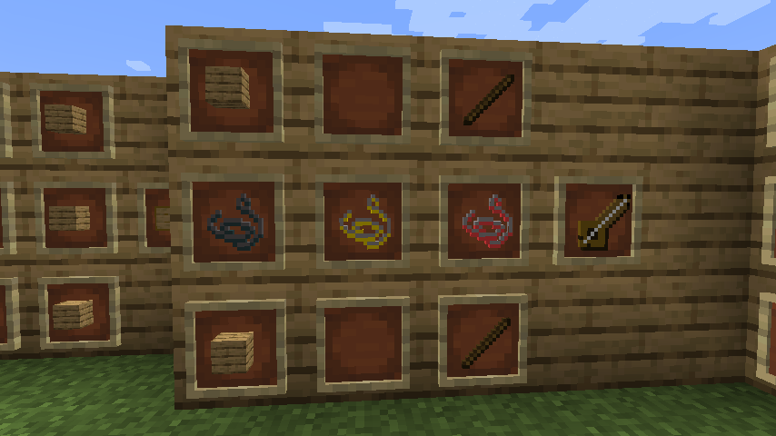

# MPOUZOUKI MOD

## Versions
* **Minecraft:** 1.21.1
* **Forge:** 52.1.0
* **Java:** 25.0.3

## Description
Πανεπιστιμιακή εργασία java Ιονίου Πανεπιστιμίου 2026, by Κωνσταντίνος Δημητρακόπουλος

## Lore
Θρύλοι λένε πως τα εγκαταλελειμμένα πλοία που ξεβράστηκαν στις ακτές ανήκαν σε Έλληνες ναυτικούς. Μαζί τους έφεραν τον ρυθμό, το κέφι και την παράδοση, αφήνοντας πίσω τους τα πρώτα μπουζούκια στον κόσμο του Minecraft.

## Video Description
[Video Demonstration](https://youtu.be/aue-rYwioe0)

## Screenshots

### MPOUZOUKI
The instrument

### Paneri
the basket which holds the flowers and shoots them!

### Kantini, Mesiani, Mpasa
the strings of the instrument. Kantini being the smallest and most thin, Mesiani being in the middle, and Mpasa being the Big and Thick string

### Mitropanos villager

## System Compatibility
This mod was successfully tested in a windows 11 machine

## Source installation information for modders
This code follows the Minecraft Forge installation methodology. It will apply some small patches to the vanilla MCP source code, giving you and it access to some of the data and functions you need to build a successful mod.

Note also that the patches are built against "un-renamed" MCP source code (aka SRG Names) - this means that you will not be able to read them directly against normal code.

## Setup Process
---

**Step 1:** Open your command-line and browse to the folder where you extracted the zip file.

**Step 2:** You're left with a choice.

### If you prefer to use Eclipse:
1. Run the following command: `./gradlew genEclipseRuns`
2. Open Eclipse, Import > Existing Gradle Project > Select Folder or run `gradlew eclipse` to generate the project.

### If you prefer to use IntelliJ:
1. Open IDEA, and import project.
2. Select your build.gradle file and have it import.
3. Run the following command: `./gradlew genIntellijRuns`
4. Refresh the Gradle Project in IDEA if required.

If at any point you are missing libraries in your IDE, or you've run into problems you can run `gradlew --refresh-dependencies` to refresh the local cache. `gradlew clean` to reset everything (this does not affect your code) and then start the process again.
